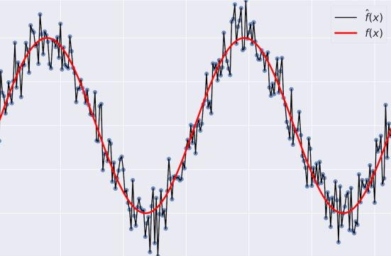

# 편향과 분산

## 편향 (bias)

- 예측값과 실제값의 차이의 평균
- 학습된 $\hat{f}(x)$가 실제 $f(x)$와 얼마나 떨어져 있는지를 알 수 있다.
- 편향이 높다면 학습된 모델이 과소적합임을 나타낸다.

## 분산 (variance)

- 예측의 변동폭
- 모델의 유연성을 의미한다.
- 주어지는 데이터셋들에 대응해 예측이 얼만큼 변화할 수 있는지 나타낸다.
- 분산이 높다면 모델이 과적합임을 나타낸다.

## 과적합(Overfitting)과 과소적합(Underfitting)

### 과적합

모델이 훈련 데이터셋을 너무나도 열심히 학습해서 학습하지 않은 다른 데이터셋에서는 예측력이 낮아지는 문제.

> 같은 문제집만 계속 풀면 다양한 유형에 대비하지 못한다.

### 과소 적합

모델이 학습이 덜 된 상태. 모델의 복잡도가 낮아 일정하고 정확한 예측이 어렵다.

> 공부를 적게하고 시험을 보면 어디서 본 것 같지만 느낌대로 찍을 수 밖에 없다.

## Bias - Variance TradeOff

예측 모델의 분산과 편향이 모두 낮으면 위의 표적 중앙을 촘촘하게 명중한 과녁처럼 정확한 모델을 만들 수 있다.

하지만 편향과 분산은 Trade off 관계이기 때문에 일반화 오류가 최소가 되도록 모델의 복잡도를 조절해야 한다.

# 교차검증

## 모델 평가를 위한 train - test data set 나누기

보통 데이터셋을 학습시킬 때 우리는 data set을 하나만 가지고 있다. 하나의 data set만으로는 모델을 검증할 수 없기 때문에 데이터를 train set과 test set으로 나누어 train set으로 학습한 모델을 test set으로 평가해야 한다.

## test set으로만 검증할 때의 문제점

test set으로만 모델을 평가하면서 성능 개선을 위해 튜닝을 하다보면 test set에서만 예측을 잘하는 모델이 될 수도 있다. 그래서 test set은 마지막 평가만을 위해 남겨두고 train set을 활용하여 검증하는 방법들이 필요하다.

## K-폴드 교차검증

train set를 K개의 Fold로 분할하여 K-1 개의 데이터를 학습한 뒤 나머지 데이터 Fold를 통해 모델을 검증하는 과정을 K번 반복하는 방식.  
K개만큼의 오차를 얻을 수 있고, 평균을 내어 교차검증 오차로 오류 정도를 평가할 수 있다.

# 앙상블 (Ensemble)

## 개념

동일한 data set을 다른 알고리즘 모델들을 활용해 각자 학습시켜 메타 모델을 만들어 Voting, Bagging, Boosting 등의 방식을 활용해 최종예측을 하는 기법.

## Voting

각 모델들이 예측을 한 후 예측값으로 투표를 하는 방식

- **Hard Votting**: 각 모델들이 예측한 class를 다수결을 통해 최종 예측값을 결정하는 방식
- **Soft Votting**: 각 모델들이 예측한 proba값(class에 해당할 확률)을 평균내어 최종 예측값을 결정하는 방식
