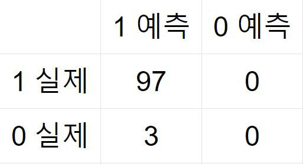
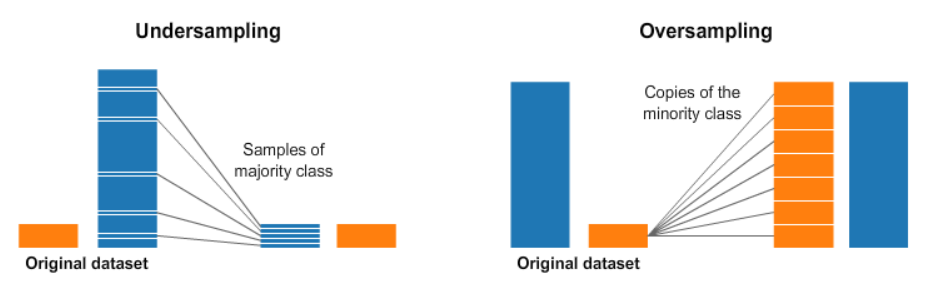
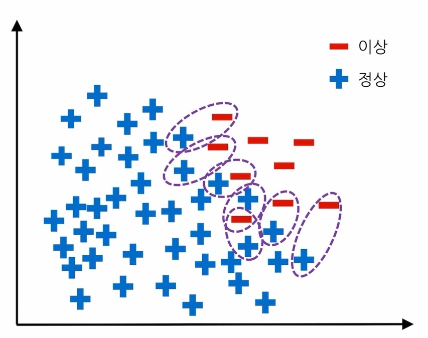
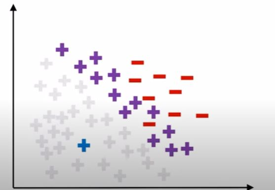
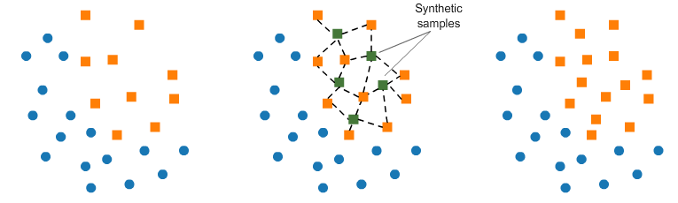

# 불균형 데이터와 해결 방안

# 주제 선정 이유

스터디에서 다룬 사이킷런의 데이터셋은 학습용 자료이기 때문에 feature들의 값들이 예측이 쉽도록 제공되어 있고, 분류 문제 등에서 과적합 오류 등이 발생되지 않도록 target들의 수도 비슷하게 구성되어 있다.  
하지만 프로젝트나 현실의 문제에서는 데이터들이 전처리조차 되어있지 않을 것이며 학습자료 같이 예측이 용이하도록 구성되어 있지는 않을 것이다.  
그래서 iris 데이터셋처럼 50개, 50개, 50개로 균형을 이루어 3가지의 품종분류를 쉽게할 수 있는 데이터셋이 아닌, 불균형 데이터를 만나게 되었을 때 활용할 수 있는 몇 가지 기법에 대해 설명하기로 한다.

# 불균형 데이터란?

분류 문제에서 데이터 집합들의 수가 불균형을 이루는 데이터를 말한다. ( ex) target 값이 1인 데이터가 100개인데 0은 10개도 채 되지 않는 경우 등)

> 대표적인 불균형 데이터 예시로 암환자를 예측하는 문제, 신용카드 부정 거래 검출, 잠재 VIP 고객 예측 등이 언급된다.

# 불균형 데이터가 발생시키는 문제

- Confusion Matrix : 분류문제에서 예측 성공 여부를 시각화한 표
- Sensivity(민감도) : 1값의 예측 성공 비율
- Specificity(특이도) : 0값의 예측 성공 비율

1값이 97개이고 0값이 3개인 불균형 데이터라면 예측모델은 모든 데이터를 1로 예측해도 정확도는 97%가 될 것이다. 다만, 0값을 하나도 예측하지 않으므로 (특이도가 낮음) 좋은 모델이라 할 수 없다.  
ML모델은 학습할 때 많은 수를 가진 클래스에 가중치를 더 두기 때문에 이러한 불균형 데이터들을 그대로 학습시키면 이후에 예측할 거의 모든 데이터들을 1로 예측할 것이다.

> 저 못 맞춘 3개의 데이터가 꼭 예측해야만 하는 데이터였다면?
> 정확도가 높다고 좋은 모델이 될 수는 없다. 따라서 분류 문제, 특히 불균형 데이터를 다룰 때에는 민감도와 특이도, 그리고 AUC-ROC를 통해 모델 성능을 측정해야 한다.

# 샘플링 (Sampling)

## 샘플링이란?

데이터 불균형을 해결하기 위해 의도적으로 많은 클래스의 수를 줄이거나(언더샘플링) 적은 클래스의 수를 늘리는(오버샘플링) 기법을 말한다.

## 언더샘플링 (Under Sampling)

### Tomek Links

최단거리의 다른 클래스 데이터 한 쌍을 만들고 그 중 다수 클래스에 해당하는 데이터를 제거하는 방법이다. 언더 샘플링으로 발생하는 데이터 손실은 적지만, 그만큼 언더샘플링의 효과도 적다.

### CNN (Condensed Nearest Neighbour)

다수 클래스의 데이터 중 무작위로 하나를 선택하여, 그 데이터보다 소수 클래스 데이터와 가까운 다수 데이터 이외의 것들을 제거하는 방법이다.

### OSS (One Side Selection)

앞서 설명한 두 방법을 같이 수행한다.

### Random Undersampling

다수 클래스에서 무작위 추출하는 방법이다. 매 시도마다 다른 결과를 보이지만, 앞서 설명한 기법들처럼 연산을 할 필요가 없으며 의외로 효과적일 때가 있다.

### 언더샘플링 기법의 장단점

- 장점
  - 다수의 데이터를 제거하므로 이후 연산 시간이 감소한다.
  - 클래스 오버랩이 감소한다.
- 단점
  - 데이터의 손실이 발생하며, 유의한 정보를 가진 데이터가 제거될 우려가 있다.

## 오버샘플링 (Over Sampling)

### 리샘플링 (Resampling)

소수 클래스의 데이터를 복사하여 데이터를 증식시키는 방법이다. 동일한 복제 데이터가 생성되기 때문에 과적합 가능성이 높다.

### SMOTE (Synthetic Minority Oversampling TEchnique)

소수 클래스의 데이터 주변에 가상의 데이터를 생성하는 방법이다. K값을 사전에 정하고 무작위로 소수 클래스 데이터를 선정한다. 그 데이터와 가장 가까운 K개의 데이터 중 하나를 선정해 Synthetic 이라는 공식을 통해 가상의 데이터를 계산한다. 이 과정을 모든 소수 클래스 데이터에서 반복 수행한다.

### SMOTE를 사용한 그 외 기법

- Borderline - SMOTE : 소수 데이터 주변을 탐색해 주변의 N개 데이터 중 다수 클래스 데이터의 수 K에 따라 경계선 여부를 결정한다. K의 수로 인해 Danger 관측치가 되면 그 데이터에 대해서 SMOTE를 적용한다.

- ADASYN : 소수 데이터 주변의 K개 데이터를 탐색하고 그 중 다수 클래스 데이터의 비율을 계산한다. ADASYN공식을 통해 정수값을 도출하고 그 값만큼 각 데이터에서 SMOTE방식을 통해 샘플링한다.

### 오버샘플링 기법의 장단점

- 장점
  - 정보의 손실이 없다.
  - 언더샘플링보다 분류 정확도가 높다.
- 단점
  - 과적합이 발생할 가능성이 높다.
  - 데이터 증가로 인해 이후 연산시간이 증가한다.
  - 이상치나 노이즈에 민감하다.

# 불균형 데이터 관련 자료

- [Inbalanced Learn 공식문서](https://imbalanced-learn.org/stable/index.html) : 설명한 샘플링 기법들을 사용할 수 있는 라이브러리
- [신용카드 사기검출 데이터셋](https://www.kaggle.com/datasets/mlg-ulb/creditcardfraud) : 불균형 데이터인 신용카드 사기검출 데이터셋
- [김성법 교수님 유튜브 강의](https://www.youtube.com/watch?v=Vhwz228VrIk&t=26s) : 자료 만들면서 참고한 강의
